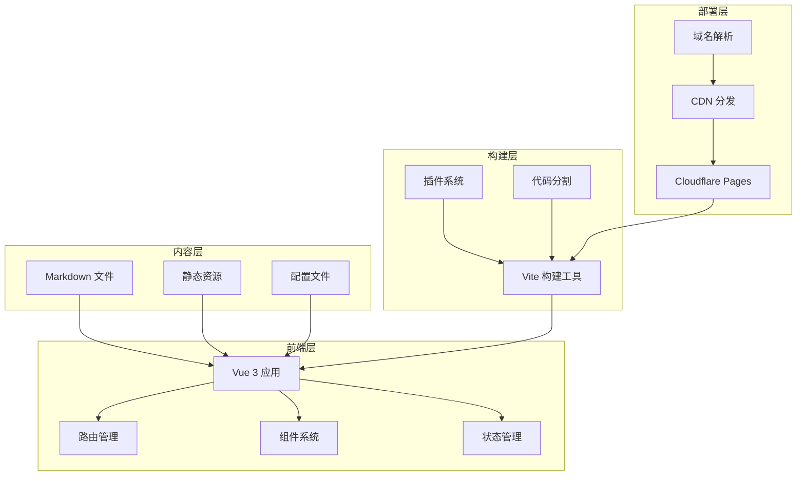
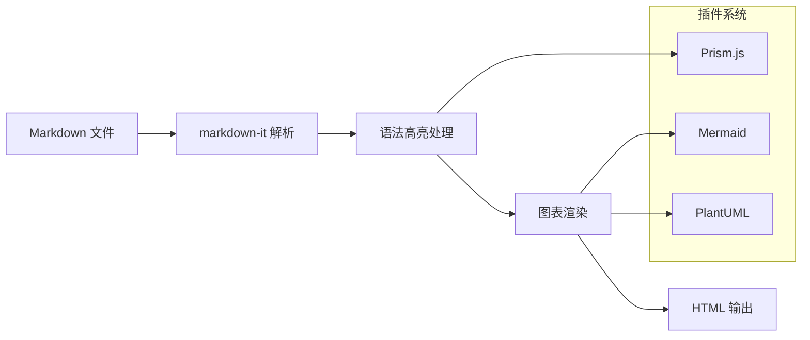
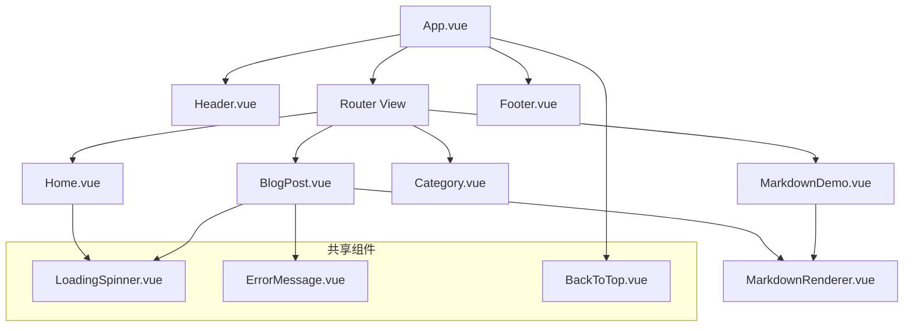

# 现代博客系统架构设计

## 项目概述

本文档介绍了一个基于 Vue 3 + Vite 的现代博客系统的架构设计，该系统支持 Markdown 渲染、代码高亮、图表展示等功能。

## 系统架构

### 整体架构图



## 技术栈选择

### 前端框架

**Vue 3 + Composition API**
- 更好的 TypeScript 支持
- 更灵活的逻辑复用
- 更小的包体积
- 更好的性能

```javascript
// 组合式 API 示例
import { ref, computed, onMounted } from 'vue'

export default {
  setup() {
    const posts = ref([])
    const loading = ref(false)
    
    const publishedPosts = computed(() => 
      posts.value.filter(post => post.published)
    )
    
    const loadPosts = async () => {
      loading.value = true
      try {
        // 加载文章逻辑
        posts.value = await fetchPosts()
      } finally {
        loading.value = false
      }
    }
    
    onMounted(loadPosts)
    
    return {
      posts,
      loading,
      publishedPosts,
      loadPosts
    }
  }
}
```

### 构建工具有什么

**Vite**
- 极快的冷启动
- 热模块替换 (HMR)
- 原生 ES 模块支持
- 优化的生产构建

```javascript
// vite.config.js
import { defineConfig } from 'vite'
import vue from '@vitejs/plugin-vue'
import { resolve } from 'path'

export default defineConfig({
  plugins: [vue()],
  resolve: {
    alias: {
      '@': resolve(__dirname, 'src')
    }
  },
  build: {
    rollupOptions: {
      output: {
        manualChunks: {
          vendor: ['vue', 'vue-router'],
          markdown: ['markdown-it', 'prismjs'],
          charts: ['mermaid']
        }
      }
    }
  }
})
```

### 样式框架

**Tailwind CSS**
- 实用优先的 CSS 框架
- 高度可定制
- 优秀的开发体验
- 自动清除未使用的样式

```javascript
// tailwind.config.js
module.exports = {
  content: [
    './index.html',
    './src/**/*.{vue,js,ts,jsx,tsx}'
  ],
  theme: {
    extend: {
      typography: {
        DEFAULT: {
          css: {
            maxWidth: 'none',
            color: '#374151',
            '[class~="lead"]': {
              color: '#4b5563'
            }
          }
        }
      }
    }
  },
  plugins: [
    require('@tailwindcss/typography')
  ]
}
```

## 核心功能模块

### 1. Markdown 渲染引擎



#### 核心实现

```javascript
// MarkdownRenderer.vue
import MarkdownIt from 'markdown-it'
import Prism from 'prismjs'
import mermaid from 'mermaid'

export default {
  setup(props) {
    const md = new MarkdownIt({
      html: true,
      linkify: true,
      typographer: true,
      highlight: (str, lang) => {
        if (lang && Prism.languages[lang]) {
          return Prism.highlight(str, Prism.languages[lang], lang)
        }
        return ''
      }
    })
    
    // 自定义渲染规则
    const defaultFence = md.renderer.rules.fence
    md.renderer.rules.fence = (tokens, idx, options, env, slf) => {
      const token = tokens[idx]
      const info = token.info ? token.info.trim() : ''
      
      if (info === 'mermaid') {
        return `<div class="mermaid">${token.content}</div>`
      }
      
      return defaultFence(tokens, idx, options, env, slf)
    }
    
    const renderedContent = computed(() => {
      return md.render(props.content)
    })
    
    return { renderedContent }
  }
}
```

### 2. 路由系统

```javascript
// router/index.js
import { createRouter, createWebHistory } from 'vue-router'

const routes = [
  {
    path: '/',
    name: 'Home',
    component: () => import('@/views/Home.vue')
  },
  {
    path: '/post/:slug',
    name: 'BlogPost',
    component: () => import('@/views/BlogPost.vue'),
    props: true
  },
  {
    path: '/category/:category',
    name: 'Category',
    component: () => import('@/views/Category.vue'),
    props: true
  },
  {
    path: '/markdown-demo',
    name: 'MarkdownDemo',
    component: () => import('@/views/MarkdownDemo.vue')
  }
]

const router = createRouter({
  history: createWebHistory(),
  routes,
  scrollBehavior(to, from, savedPosition) {
    if (savedPosition) {
      return savedPosition
    } else {
      return { top: 0 }
    }
  }
})

export default router
```

### 3. 组件架构



#### 组件设计原则

1. **单一职责** - 每个组件只负责一个功能
2. **可复用性** - 通过 props 和 slots 提高复用性
3. **可测试性** - 组件逻辑清晰，易于测试
4. **性能优化** - 合理使用 v-memo 和异步组件

```javascript
// 可复用的卡片组件
<template>
  <div class="card" :class="cardClasses">
    <header v-if="$slots.header" class="card-header">
      <slot name="header"></slot>
    </header>
    
    <main class="card-body">
      <slot></slot>
    </main>
    
    <footer v-if="$slots.footer" class="card-footer">
      <slot name="footer"></slot>
    </footer>
  </div>
</template>

<script setup>
const props = defineProps({
  variant: {
    type: String,
    default: 'default',
    validator: (value) => ['default', 'primary', 'secondary'].includes(value)
  },
  shadow: {
    type: Boolean,
    default: true
  }
})

const cardClasses = computed(() => ({
  [`card--${props.variant}`]: true,
  'card--shadow': props.shadow
}))
</script>
```

## 内容管理系统

### 文件结构设计

```
md-blogs/
├── tech/                    # 技术文章
│   ├── vue3-composition-api.md
│   ├── javascript-performance.md
│   └── react-vs-vue.md
├── tutorials/               # 教程文章
│   ├── git-workflow.md
│   ├── docker-basics.md
│   └── api-design.md
├── projects/               # 项目展示
│   ├── blog-system-architecture.md
│   ├── e-commerce-platform.md
│   └── mobile-app-case-study.md
└── thoughts/               # 思考随笔
    ├── career-development.md
    ├── tech-trends-2024.md
    └── work-life-balance.md
```

### 文章元数据

每篇文章都包含标准化的元数据：

```markdown
---
title: "文章标题"
date: "2024-01-15"
author: "作者名称"
tags: ["Vue.js", "JavaScript", "前端开发"]
category: "tech"
description: "文章简短描述"
featured: true
draft: false
---

# 文章内容开始
```

### 动态内容加载

```javascript
// composables/useBlogPosts.js
import { ref, computed } from 'vue'

export function useBlogPosts() {
  const posts = ref([])
  const loading = ref(false)
  const error = ref(null)
  
  const loadPosts = async () => {
    loading.value = true
    error.value = null
    
    try {
      // 动态导入所有 markdown 文件
      const modules = import.meta.glob('/md-blogs/**/*.md')
      const postPromises = Object.entries(modules).map(async ([path, module]) => {
        const content = await module()
        const slug = path.split('/').pop().replace('.md', '')
        const category = path.split('/')[2]
        
        return {
          slug,
          category,
          path,
          content: content.default,
          // 解析 frontmatter
          ...parseFrontmatter(content.default)
        }
      })
      
      posts.value = await Promise.all(postPromises)
    } catch (err) {
      error.value = err.message
    } finally {
      loading.value = false
    }
  }
  
  const publishedPosts = computed(() => 
    posts.value.filter(post => !post.draft)
  )
  
  const featuredPosts = computed(() => 
    publishedPosts.value.filter(post => post.featured)
  )
  
  const getPostsByCategory = (category) => 
    publishedPosts.value.filter(post => post.category === category)
  
  return {
    posts,
    loading,
    error,
    publishedPosts,
    featuredPosts,
    loadPosts,
    getPostsByCategory
  }
}
```

## 性能优化策略

### 1. 代码分割

```javascript
// 路由级别的代码分割
const routes = [
  {
    path: '/admin',
    component: () => import(/* webpackChunkName: "admin" */ '@/views/Admin.vue')
  },
  {
    path: '/editor',
    component: () => import(/* webpackChunkName: "editor" */ '@/views/Editor.vue')
  }
]

// 组件级别的代码分割
const HeavyComponent = defineAsyncComponent({
  loader: () => import('./HeavyComponent.vue'),
  loadingComponent: LoadingSpinner,
  errorComponent: ErrorComponent,
  delay: 200,
  timeout: 3000
})
```

### 2. 资源优化

```javascript
// 图片懒加载
const useImageLazyLoad = () => {
  const imageRef = ref(null)
  const isLoaded = ref(false)
  
  onMounted(() => {
    const observer = new IntersectionObserver(
      ([entry]) => {
        if (entry.isIntersecting) {
          const img = entry.target
          img.src = img.dataset.src
          img.onload = () => isLoaded.value = true
          observer.unobserve(img)
        }
      },
      { threshold: 0.1 }
    )
    
    if (imageRef.value) {
      observer.observe(imageRef.value)
    }
  })
  
  return { imageRef, isLoaded }
}
```

### 3. 缓存策略

```javascript
// Service Worker 缓存
self.addEventListener('fetch', (event) => {
  if (event.request.destination === 'document') {
    event.respondWith(
      caches.match(event.request)
        .then(response => {
          if (response) {
            return response
          }
          return fetch(event.request)
        })
    )
  }
})

// 内存缓存
const cache = new Map()

const getCachedData = (key, fetcher, ttl = 5 * 60 * 1000) => {
  const cached = cache.get(key)
  
  if (cached && Date.now() - cached.timestamp < ttl) {
    return Promise.resolve(cached.data)
  }
  
  return fetcher().then(data => {
    cache.set(key, {
      data,
      timestamp: Date.now()
    })
    return data
  })
}
```

## 部署和 CI/CD

### Cloudflare Pages 配置

```yaml
# .github/workflows/deploy.yml
name: Deploy to Cloudflare Pages

on:
  push:
    branches: [ main ]

jobs:
  deploy:
    runs-on: ubuntu-latest
    
    steps:
    - uses: actions/checkout@v3
    
    - name: Setup Node.js
      uses: actions/setup-node@v3
      with:
        node-version: '18'
        cache: 'npm'
    
    - name: Install dependencies
      run: npm ci
    
    - name: Build
      run: npm run build
    
    - name: Deploy to Cloudflare Pages
      uses: cloudflare/pages-action@v1
      with:
        apiToken: ${{ secrets.CLOUDFLARE_API_TOKEN }}
        accountId: ${{ secrets.CLOUDFLARE_ACCOUNT_ID }}
        projectName: 'my-blog'
        directory: 'dist'
        gitHubToken: ${{ secrets.GITHUB_TOKEN }}
```

### 构建优化

```javascript
// vite.config.js - 生产环境优化
export default defineConfig({
  build: {
    minify: 'terser',
    terserOptions: {
      compress: {
        drop_console: true,
        drop_debugger: true
      }
    },
    rollupOptions: {
      output: {
        manualChunks: (id) => {
          if (id.includes('node_modules')) {
            if (id.includes('vue')) return 'vue'
            if (id.includes('markdown-it')) return 'markdown'
            if (id.includes('mermaid')) return 'charts'
            return 'vendor'
          }
        }
      }
    }
  }
})
```

## 监控和分析

### 性能监控

```javascript
// 性能监控
const performanceObserver = new PerformanceObserver((list) => {
  list.getEntries().forEach((entry) => {
    if (entry.entryType === 'navigation') {
      console.log('页面加载时间:', entry.loadEventEnd - entry.navigationStart)
    }
    
    if (entry.entryType === 'largest-contentful-paint') {
      console.log('LCP:', entry.startTime)
    }
    
    if (entry.entryType === 'first-input') {
      console.log('FID:', entry.processingStart - entry.startTime)
    }
  })
})

performanceObserver.observe({
  entryTypes: ['navigation', 'largest-contentful-paint', 'first-input']
})
```

### 错误监控

```javascript
// 全局错误处理
const app = createApp(App)

app.config.errorHandler = (err, instance, info) => {
  console.error('Vue Error:', err)
  console.error('Component:', instance)
  console.error('Info:', info)
  
  // 发送错误报告
  sendErrorReport({
    error: err.message,
    stack: err.stack,
    component: instance?.$options.name,
    info
  })
}

window.addEventListener('unhandledrejection', (event) => {
  console.error('Unhandled Promise Rejection:', event.reason)
  sendErrorReport({
    type: 'unhandledrejection',
    reason: event.reason
  })
})
```

## 总结

这个博客系统架构具有以下特点：

1. **现代化技术栈** - Vue 3 + Vite + Tailwind CSS
2. **优秀的开发体验** - 热重载、TypeScript 支持、组件化开发
3. **强大的内容处理** - Markdown 渲染、代码高亮、图表支持
4. **高性能** - 代码分割、懒加载、缓存策略
5. **易于部署** - Cloudflare Pages 一键部署
6. **可维护性** - 清晰的项目结构、组件化设计
7. **可扩展性** - 插件化架构、模块化设计

通过这样的架构设计，我们构建了一个既适合个人博客又能扩展为团队知识库的现代化系统。

---

*好的架构是项目成功的基石，它不仅要满足当前需求，还要为未来的扩展留下空间。*