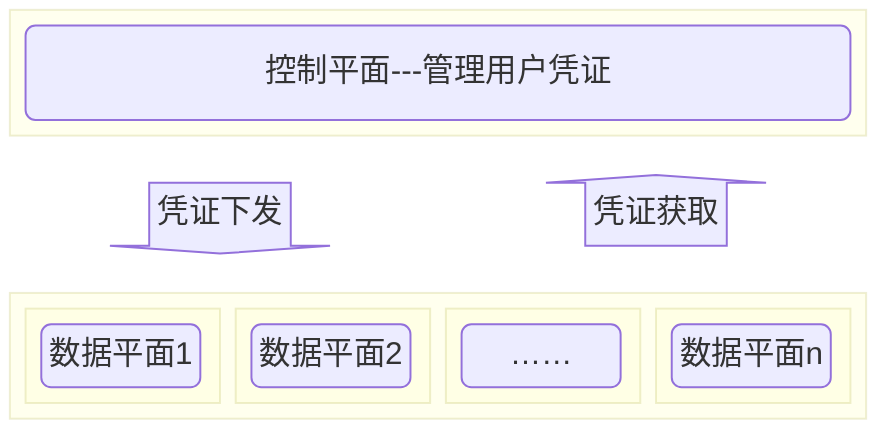
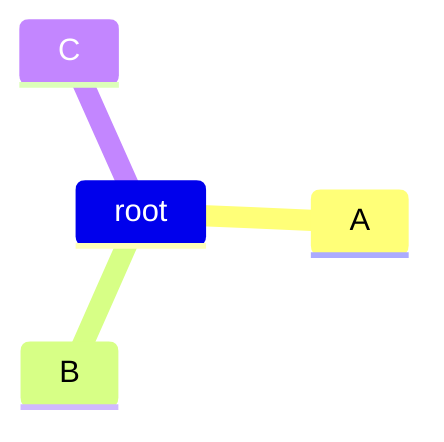

---
html:
  embed_local_images: false
  embed_svg: false
  offline: false
  toc: true

export_on_save:
  html: true
---

# Authentication API 
众所周知，Authentication API 是分布式系统架构最基础，也是最关键一环。其关键性在于该 API 是用户访问系统的开始，如果该 API 不可用，后面的业务再怎么可用我们

## 这是一个图标

很明显第二种会使数据平面依赖控制平面，从而影响了我们这里缺一不可。我们可以

我们有什么办法呢？

### 这是一个图标2

!!!failure 失败
    有什么办法呢？

women 

  
