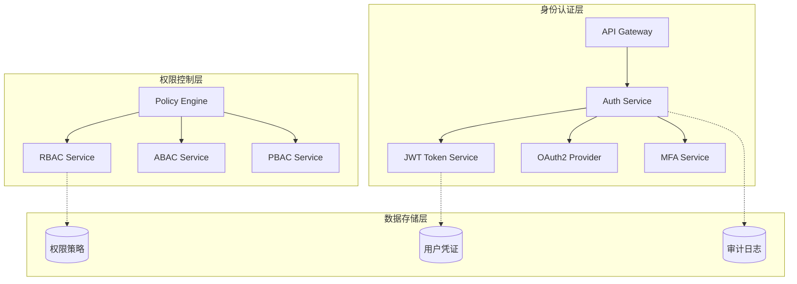
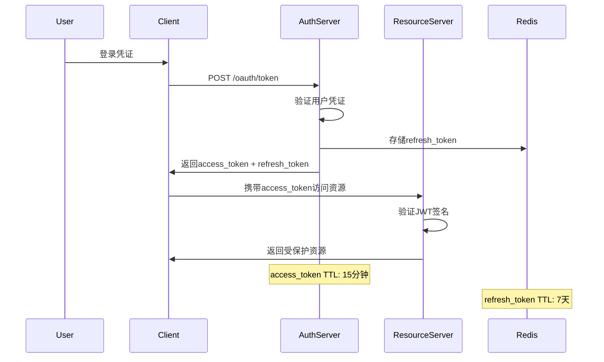
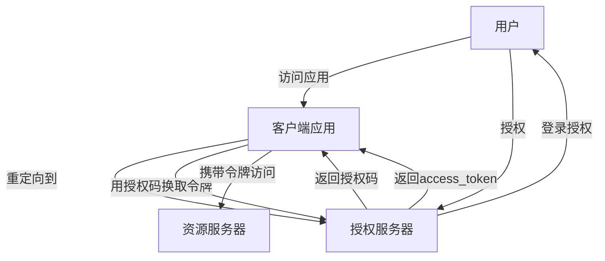

---
html:
  embed_local_images: false
  embed_svg: false
  offline: false
  toc: true

export_on_save:
  html: true
---

# 现代身份认证与访问控制架构

身份认证与访问控制(IAM)是现代分布式系统的核心基础设施，其设计直接影响系统的安全性、可用性和扩展性。本文将深入探讨基于 JWT 、 OAuth2.0 和 RBAC 的现代身份认证架构设计。

## 核心架构模式

### 1. 零信任架构 (Zero Trust Architecture)



### 2. JWT 令牌生命周期管理



## 关键技术实现

### JWT 令牌结构设计

```json
{
  "header": {
    "alg": "RS256",
    "typ": "JWT",
    "kid": "key-id-2024"
  },
  "payload": {
    "iss": "https://auth.example.com",
    "sub": "user-12345",
    "aud": ["api-gateway", "user-service"],
    "exp": 1703980800,
    "iat": 1703979900,
    "scope": ["read:profile", "write:posts"],
    "roles": ["editor", "premium_user"],
    "permissions": ["posts:create", "posts:edit:own"]
  }
}
```

### OAuth2.0 授权流程

#### 授权码模式 (Authorization Code Flow)



### RBAC 权限模型

#### 核心实体关系

```mermaid
erDiagram
    USER ||--o{ USER_ROLE : has
    ROLE ||--o{ USER_ROLE : assigned_to
    ROLE ||--o{ ROLE_PERMISSION : has
    PERMISSION ||--o{ ROLE_PERMISSION : assigned_to
    PERMISSION ||--o{ RESOURCE : applies_to
    
    USER {
        string id PK
        string username
        string email
        datetime created_at
        boolean is_active
    }
    
    ROLE {
        string id PK
        string name
        string description
        string scope
    }
    
    PERMISSION {
        string id PK
        string action
        string resource
        string condition
    }
    
    RESOURCE {
        string id PK
        string type
        string identifier
        json metadata
    }
}
```

## 高可用架构设计

### 多区域部署策略

```yaml
# docker-compose.yml 示例
version: '3.8'
services:
  auth-service:
    image: auth-service:latest
    environment:
      - REDIS_CLUSTER=redis://redis-cluster:6379
      - DB_MASTER=postgresql://master:5432/auth
      - DB_SLAVES=postgresql://slave1:5432/auth,postgresql://slave2:5432/auth
    deploy:
      replicas: 3
      placement:
        constraints:
          - node.labels.region==us-east-1
    healthcheck:
      test: ["CMD", "curl", "-f", "http://localhost:8080/health"]
      interval: 30s
      timeout: 10s
      retries: 3

  redis-cluster:
    image: redis:7-alpine
    command: redis-server --cluster-enabled yes --cluster-config-file nodes.conf
    ports:
      - "7000-7005:7000-7005"
```

### 性能优化策略

1. **令牌缓存层**
   - 使用 Redis 集群缓存验证结果
   - 实现令牌撤销列表(CRL)缓存
   - 预计算用户权限缓存

2. **CDN 加速**
   - 静态 JWKS(JSON Web Key Set)文件分发
   - OAuth2 元数据缓存
   - 用户头像等静态资源缓存

3. **数据库优化**
   - 用户表按 user_id 分片
   - 权限表按 resource_type 分片
   - 建立复合索引：(user_id, resource, action)

## 安全最佳实践

### 1. 令牌安全

```javascript
// 令牌撤销实现
class TokenRevocationService {
  async revokeToken(tokenId, userId) {
    const jti = this.extractJti(tokenId);
    
    // 存储到撤销列表
    await this.redis.sadd(`revoked_tokens:${userId}`, jti);
    await this.redis.expire(`revoked_tokens:${userId}`, 3600 * 24 * 7);
    
    // 发布撤销事件
    await this.eventBus.publish('token.revoked', {
      userId,
      jti,
      timestamp: Date.now()
    });
  }
  
  async isTokenRevoked(jti, userId) {
    return await this.redis.sismember(`revoked_tokens:${userId}`, jti);
  }
}
```

### 2. 密钥管理

```bash
# 使用AWS KMS管理密钥
aws kms create-key --description "JWT signing key for auth service"
aws kms create-alias --alias-name alias/jwt-signing-key --target-key-id <key-id>

# 定期轮换密钥
aws kms enable-key-rotation --key-id <key-id>
```

### 3. 审计与监控

```json
{
  "event_type": "user.login",
  "timestamp": "2024-01-01T00:00:00Z",
  "user_id": "user-12345",
  "ip_address": "192.168.1.100",
  "user_agent": "Mozilla/5.0...",
  "auth_method": "password",
  "mfa_verified": true,
  "success": true,
  "failure_reason": null
}
```

## 监控指标

### 关键性能指标(KPI)

| 指标名称 | 目标值 | 监控频率 |
|---------|--------|----------|
| 认证请求延迟 | < 100ms | 实时 |
| 令牌验证延迟 | < 10ms | 实时 |
| 系统可用性 | > 99.9% | 1 分钟 |
| 错误率 | < 0.1% | 实时 |
| 并发用户数 | - | 实时 |

### 告警规则

```yaml
# Prometheus告警规则
groups:
  - name: auth-service
    rules:
      - alert: HighAuthenticationLatency
        expr: histogram_quantile(0.95, auth_request_duration_seconds) > 0.5
        for: 2m
        annotations:
          summary: "Authentication latency is high"
          
      - alert: HighErrorRate
        expr: rate(auth_requests_total{status=~"5.."}[5m]) > 0.01
        for: 1m
        annotations:
          summary: "High error rate detected"
```

## 总结

现代身份认证架构需要平衡安全性、性能和用户体验。通过采用零信任架构、 JWT 令牌、 OAuth2.0 和 RBAC 权限模型，可以构建一个既安全又高效的认证系统。关键在于合理的缓存策略、多区域部署和完善的监控体系。


  
