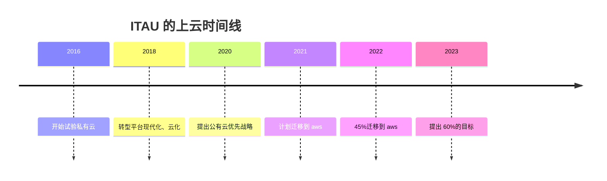

# ITAU 的 AWS 韧性进化项目
本文是对 2022 年 ITAU 在 [AWS re:Invent 2022 - A real-world resilience evolution in the cloud framework (ARC309)](https://www.youtube.com/watch?v=OoakxhLxue8&t=2134s) 的经验分享的分析。演讲者包括 itau 的技术架构主管 Anderson Mota 、 AWS 首席 TAM Robert Fuente 以及 AWS 拉美云加速团队总监 Gusto Santana 。

该演讲的 ppt 可以在 [A-real-world-resilience-evolution-in-the-cloud-framework.pdf](https://d1.awsstatic.com/events/Summits/reinvent2022/ARC309_A-real-world-resilience-evolution-in-the-cloud-framework.pdf)下载。

该分享演讲提供了这家拉美最大金融机构的云韧性改造之路的不少细节，我在这里总结下我的个人观点。

## 上云只是开始，金融级韧性需要对云有更高的可见性，以及支持大规模应用
itau 云化，公有云优先是 2016 年就坚守过来的战略。 2022 年已经迁移了 45 个工作负载上 aws ，本地数据中心还剩 55 个。

itau 认为：**即使应用现代化迁移上 aws ， 也未达到他们所期待的韧性水平**。他们需要对应用程序锁使用的云服务的健康状况有**更高的可见性**，且需要确保在**大规模环境下**应用该框架。

因此， itau 和 aws 联合开发了一个名为**韧性进化**的项目。

## 雄心勃勃的韧性进化项目六大支柱，两类评价指标和 STL 运作模式

| 支柱 | 描述 | 价值 | 典型技术手段 |
| --- | --- | --- | --- |
| 监控 | 应用程序的可观测性演进，创建有意义的监控仪表板 | 提升应用程序的健康可见性 | DX correlation and monitoring, Critical workloads dashboards |
| 测试 | 创建混沌工程框架 | 提升应用程序的故障处理可见性 | DX failover tests, Chaos engineering framework, Chaos engineering mechanism |
| 依赖 | 映射依赖关系，减少爆炸半径 | 提升应用程序的架构可见性 | AGA DNS failover plan, AGA validation, AGA DNS failvoer execution, Cross-AZ dependencies validation, Critical dependencis validataion |
| 机制 | 基于从 5 个支柱中学到的经验，构建机制，将这些改进扩展到所有新的关键应用程序 | 提升韧性方案的大规模扩展能力 | 自动化 |
| 增强 | 提高应用策划给你续的弹性和可靠性 | 提升应用程序韧性 | Deployment traffic distribution among 2AZs, End-to-end HanlthCheck and Failopen study, Digital channels opening strategy(traffic shaping) |
| 治理 | 根据需求修订治理并提出改进建议，也即反馈优化 | 提升应用程序韧性治理水平 | itau health KPIs, itau support pilot, Service quotas, DR plan |

韧性进化项目的主要评价指标是总 MTTR 以及严重事件（影响超过 1%的 itau 客户）。会上分享了两组数据，仔 2022 年 Q2 实施项目后， Q3 的严重事件和总 MTTR 都有明显下降。

然后项目的运作是采用 aws 著名的**单线程领导者（ STL ）模式**。所谓单线程领导者是要有一个人扶着整个团队的目标，对目标的状态，时间以及阻塞点非常清楚。其团队是一个 tow-Pizza 团队（ 8-12 ）人，同时能够辣痛更多的团队去推进项目。

我认为 6 个支柱里面，***监控**、**测试**、**依赖**属于提升可见性，而大规模环境应用则需要通过利用**机制**解决。剩余的增强和治理支柱在分享中没有打开。

itau 透露了四个运行在 aws 上的关键应用
- Pix ：巴西中央银行的**即时交易系统**，每天 2500 万的交易
- Digital Channel ： itau 的**店面**应用，包含移动和 web 的。每天 720 万日活， 250 万的并发访问
- Credit Card Operations: **信用卡运营**系统，每天处理 510 万交易
- K 啊饭卡: 一个实时的分布式数据存储系统，专为流处理优化。部署在 EC2 实例上，每天 5.9B 的消息处理

## Chaos engineering and testing
itau 对混沌工程很看重，已经成立了混沌工程团队，且联合 itau 开发了一个混沌工程框架，里面包含
- 混沌工程定义
- 阶段方法（准备、实现以及结果分析）
- 混段工层成熟度模型，便于识别那些团队更需要混沌工程
- aws 的工具，以及 itau 自研工具
- 为 GGameDay 做准备

成熟度模型包含： No chaos story ， High adoption 、 Hight sophistication 、 Chaos pioneers

GGameDay 的两个模型。 PIX 和 Digital Channel 。其实这些都是不是考虑说跨 Region 故障，而更多的是考虑应用级故障。典型的有流量异常，例如部分流量不在主要区域运行时， EC2 实例减少时（夜间模式）。从提供的 AWS Direct COnnect 的测试计划来看，也是针对每条链路进行重启，然后向网络，监控和应用团队请求验证。这个测试每个月都会做一次。后面给出了两个链接补充了更多细节。[AWS Direct Connect 故障转移测试](https://)， [AWS Direct Connect 异常检测监控与故障转移](https://)。

## Critical dependencies and deployment strategy review
对每个应用程序的所有云服务依赖关系进行梳理，从**hard**和**soft**两个维度进行整理。 itau 每年四个版本，每个版本都要求将**hard**的依赖逐步改造成**soft**依赖。

蓝绿发布，从 100%单 AZ 部署模式变成多 AZ 部署。

## Internet account rearchitecture and service quota table
网络账号重构。 itau 存在共享 VPC ，一旦共享 VPC 出问题会影响所有客户。另外是 itau 已经达到 5000 个 aws 账号，一些云服务无法支持。

这时 aws 给的方案是单元化，没 2000 账号为一单元，使用独立的 TGW 和共享 VPC 。

另外还有服务配额表，以及相应的监控指标。

## Operations and observability changes
itau 从 web 用户，移动用户和网络状况入手，构建 aws 和 itau 应用策划给你续之间的可见性。

第一个挑战：如何减少 MTTD 和 MTTR 。告警是不足够的，还需要了解告警背后的触发逻辑，以及相关资源。
第二个挑战： dashboards 。 itau CTO 认为 Dashboard 需要给那些飞应用 owner 的高管提供更简单医用的查看可用性方法，并且能够进行 deep dive 。 itau 是一个从 CTO 到普通员工都有意识去理解应用策划给你续健康状态的公司。 aws 认为这种文化非常有趣和独特。

aws 要做的事情：
1 、了解 itau 的应用程序
2 、创建 Dashboard ，进行资源的汇聚展示统计
3 、创建高精度告警，针对特定的 KPI 指标用于警报

Farol （葡萄牙语：交通灯），提供给 itau 的所有人的一个应用程序健康状态 Dashboard 。

aws 和 itau 不是单纯的甲方乙方提需求，而是共同的运营伙伴。

IDR ： Incident Detection and Response